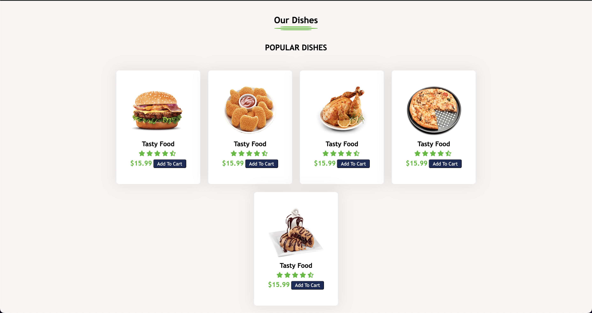

# Restaurant-Landing-Page

)

## Project Description
A responsive landing page for a restaurant, designed to showcase the restaurant’s menu, about us section and special dish. Built using HTML and CSS, the page is optimized for both desktop and mobile users.

## Usage
You can view the restaurant landing page by opening the `index.html` file in your browser.

Alternatively, you can visit the live demo:
[Live Demo](https://ayman17.github.io/Restaurant-Landing-Page/)

### Features
- Full responsive design
- Hero section with restaurant introduction
- Menu showcase
- About us section

## Screenshots

